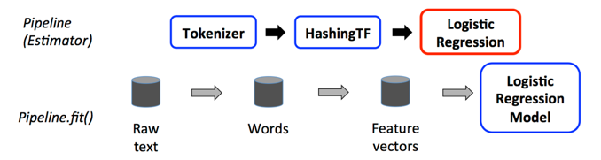

# Mleap Demo Airbnb Price Prediction
## Links
#### 
Spark Processing, ML
 
https://notebook.community/TrueCar/mleap-demo/notebooks/MLeap%20-%20Train%20Airbnb%20Price%20Prediction%20Model%20-%20Spark%20Saturday

MLeap Pipeline Serialization
 
https://github.com/combust/mleap

Sbt Multi Project
 
https://www.scala-sbt.org/1.x/docs/Multi-Project.html
#### 

# Summary
#### model
Train linear regression and random forest model\
Convert the Spark Model to Mleap Model\

#### server
Start MLeap Server with model

## Steps
#### 

## Knowledge

#### (a) Spark Pipeline 
https://www.cnblogs.com/kongchung/p/5776727.html

1.\
https://spark.apache.org/docs/3.2.0/api/scala/org/apache/spark/ml/Transformer.html
 
Transformer: transform() a DataFrame to another DataFrame\

2.\
https://spark.apache.org/docs/3.2.0/api/scala/org/apache/spark/ml/Estimator.html
 
Estimator: fit() a DataFrame into a Transformer\

3.\
Pipeline: Connect multiple Transformer, Estimator into a ML Workflow

#### (b) Spark Pipeline 2.
https://spark.apache.org/docs/1.6.0/ml-guide.html

Top row represents a Pipeline with three stages. The first two (Tokenizer and HashingTF) are Transformers (blue), and the third (LogisticRegression) is an Estimator (red)

## Debug
#### (a) ClassNotFoundException: breeze.storage.Zero$DoubleZero$
import "org.scalanlp" %% "breeze-natives" % "2.1.0"

#### (b) Java 17 not compatible
--add-opens=java.base/java.nio=ALL-UNNAMED
--add-exports=java.base/sun.nio.ch=ALL-UNNAMED
--add-opens=java.base/java.util=ALL-UNNAMED
--add-opens=java.base/java.lang=ALL-UNNAMED
--add-opens=java.base/java.lang.invoke=ALL-UNNAMED
